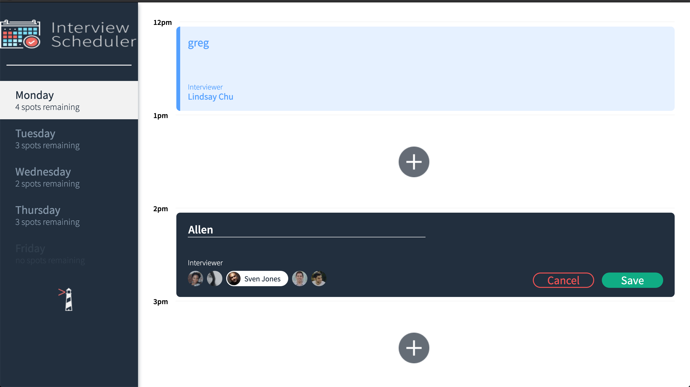
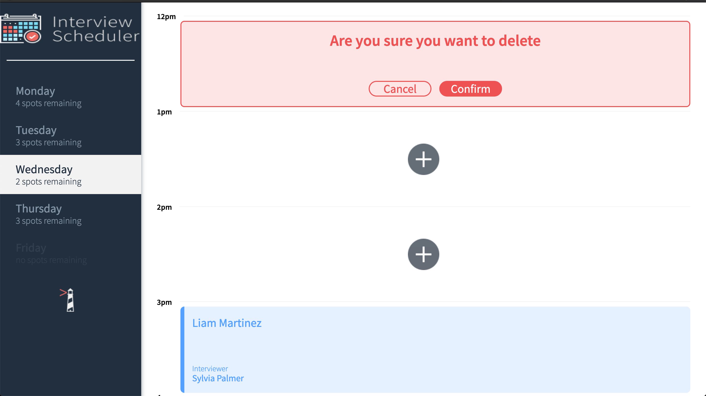
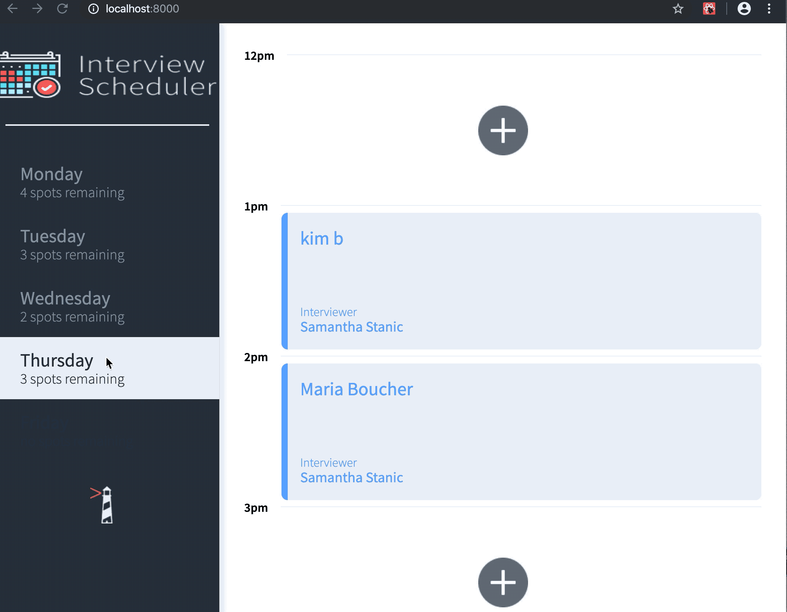

# Interview Scheduler

An introductory project using React, Storybook, and webpack. As well as Jest, and Cypress for testing. The project also uses WebSockets to allow for multiple users to see the changes made by another user immediately.

Users can navigate to a day of the week and add, edit or delete appointments in one of five available time slots

## Final Product
...adding an appointment


...a confirmation message


...in action


## Setup

Install dependencies with `npm install`.

## Running Webpack Development Server

```sh
npm start
```

## Running Jest Test Framework

```sh
npm test
```

## Running Storybook Visual Testbed

```sh
npm run storybook
```

### Known Limitations, Bugs
* Absolutely no limitations, or bugs. The app can do everything perfectly, except...
* No validation of the input field: users can't book an appointment if they leave the name field blank, but whitespace is allowed at this point